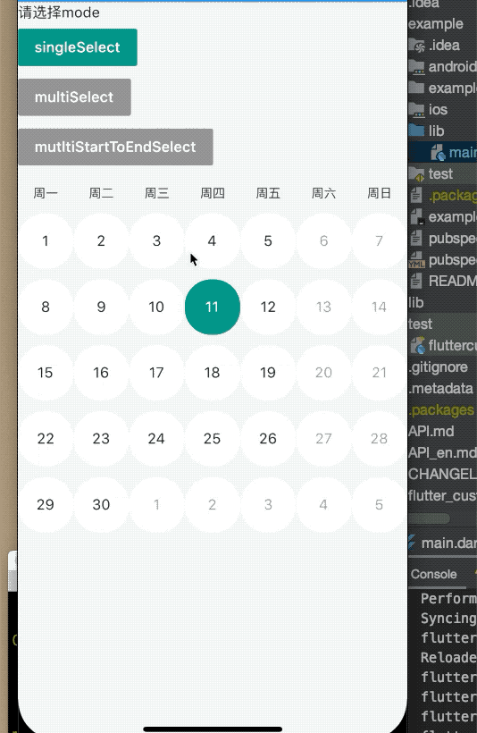

## flutter_custom_calendar
> 本插件是基于[flutter_custom_calendar](https://github.com/fluttercandies/flutter_custom_calendar)做了稍微的修改进行上传的。

具体使用方法见[flutter_custom_calendar](https://github.com/ifgyong/flutter_custom_calendar)

新增一个选择`mode`

支持选择开始和结束，选择范围内的日期，使用方法

```
controller = new CalendarController(
    minYear: 2019,
    minYearMonth: 1,
    maxYear: 2021,
    maxYearMonth: 12,
    showMode: CalendarConstants.MODE_SHOW_MONTH_AND_WEEK,
    selectedDateTimeList: _selectedDate,
    selectMode: CalendarSelectedMode.mutltiStartToEndSelect)
  ..addOnCalendarSelectListener((dateModel) {
    _selectedModels.add(dateModel);
  })
  ..addOnCalendarUnSelectListener((dateModel) {
    if (_selectedModels.contains(dateModel)) {
      _selectedModels.remove(dateModel);
    }
  });

```
`CalendarSelectedMode.mutltiStartToEndSelect`这个选择模式会选择开始和结束中间的 默认选择的。


### 安装和使用

Use this package as a library
1. Depend on it
Add this to your package's pubspec.yaml file:

```
dependencies:
  flutter_custom_calendar: ^1.0.4+0.5
```

2. Install it
You can install packages from the command line:

with Flutter:

```
$ flutter pub get
```

Alternatively, your editor might support flutter pub get. Check the docs for your editor to learn more.

3. Import it
Now in your Dart code, you can use:

```
import 'package:flutter_custom_calendar/flutter_custom_calendar.dart';
```
### 监听月视图和周视图状态

```dart    WidgetsBinding.instance.addPostFrameCallback((timeStamp) {
  controller.addExpandChangeListener((value) {
    /// 添加改变 月视图和 周视图的监听
    _isMonthSelected = value;
    setState(() {});
  });
});
```
### 变更月视图和周视图
> 前提条件是`showModel`是`CalendarConstants.MODE_SHOW_MONTH_AND_WEEK`或者`CalendarConstants.MODE_SHOW_WEEK_AND_MONTH`.

#### 变更到周视图
```dart
 setState(() {
 controller.weekAndMonthViewChange(CalendarConstants.MODE_SHOW_ONLY_WEEK);
                  });
```

#### 变更到月视图
```dart
setState(() {controller.weekAndMonthViewChange(CalendarConstants.MODE_SHOW_ONLY_MONTH);
                  });
```

### 动画演示

### [查看API](https://github.com/ifgyong/flutter_custom_calendar/blob/master/API.md)

### [查看一个例子 如何使用](https://github.com/ifgyong/flutter_custom_calendar/blob/master/example/lib/main.dart)
